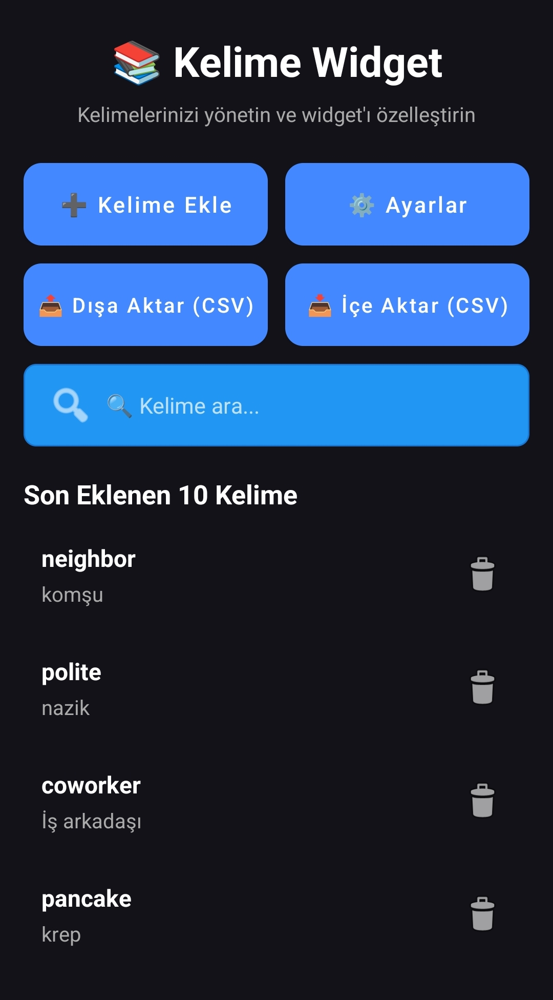
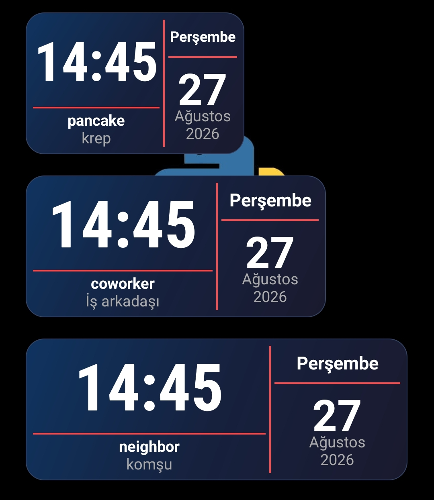

# 📚 WordWidget (Kelime Widget)

**WordWidget**, Android ana ekranınızda İngilizce-Türkçe kelime çiftlerini şık ve asimetrik bir widget ile gösteren, hafif ve son derece stabil bir kelime öğrenme uygulamasıdır.


## ✨ Özellikler

### 📱 Widget Özellikleri
- **Asimetrik ve Şık Tasarım**: Saat, tarih ve kelime dengeli bir şekilde yerleştirilmiştir.
- **Dinamik Kelime Düzeni**: Kısa kelimeler yan yana, uzun kelimeler alt alta otomatik olarak düzenlenir.
- **Son Gösterilen 5 Kelime Geçmişi**: Ana ekranda, kelimelerin gösterilme zamanı ve tarihiyle birlikte son 5 kelimenin geçmişi tablo formatında tutulur.
- **Tekrar Önleme**: Aynı kelime üst üste iki kez gösterilmez.
- **Akıllı Kategori Yönetimi**: Kelimeler farklı kategorilere (Kişisel, A1-A2, İş İngilizcesi vb.) ayrılabilir ve widget'ta hangi kategorilerin gösterileceği anlık olarak seçilebilir.

### 📝 Uygulama Özellikleri
- **Anlık Arama ve Düzenleme**: Kelimeler arasında anlık arama yapabilir ve herhangi bir kelimeye tıklayarak kolayca düzenleyebilirsiniz.
- **Gelişmiş CSV Yönetimi**:
  - **Dışa Aktarma**: `KelimeWidget_YYYYMMDD_HHMM.csv` formatında otomatik zaman damgalı dosyalar oluşturur.
  - **İçe Aktarma**: Yinelenen (duplicate) kelime kontrolü ile güvenli içe aktarma sağlar.
  - **UTF-8 Desteği**: Türkçe karakterler (ç, ğ, ı, ö, ş, ü) sorunsuz şekilde desteklenir.
- **Yüksek Performans**: Veritabanı işlemleri önbellekleme (cache) mekanizması ile optimize edilmiştir, donma veya gecikme yaşanmaz.

## 📸 Ekran Görüntüleri
*(Uygulamanın ekran görüntülerini `screenshots` klasörüne ekleyerek aşağıdaki linkleri güncelleyebilirsiniz)*
| Ana Ekran | Widget Görünümü | Ayarlar |
| :---: | :---: | :---: |
|  |  |  |

## 🚀 Kurulum ve Kullanım
1. Bu depoyu klonlayın:
   ```bash
   git clone https://github.com/ERKANONER23/WordWidget.git
2. Projeyi Android Studio'da açın.
3. Build > Rebuild Project yaparak bağımlılıkları senkronize edin.
4. Uygulamayı bir emülatöre veya fiziksel cihaza yükleyin.

## ⚙️ İzinler
Depolama: CSV dosyalarını İndirilenler klasörüne kaydetmek ve okumak için kullanılır (Modern ActivityResultContracts API'si ile güvenli bir şekilde yönetilir).
## 🛠️ Teknoloji Yığını
Dil: Kotlin
Mimari: Activity-based, hafif veri saklama (SharedPreferences)
Arka Plan İşlemleri: AlarmManager (setExactAndAllowWhileIdle) ve BroadcastReceiver
UI: RecyclerView, AppWidgetProvider, TextClock
## 🤝 Katkıda Bulunma
Katkılarınıza açığız! Lütfen bir özellik istemek veya hata bildirmek için bir "Issue" açın veya bir "Pull Request" gönderin.
## 📜 Lisans
Bu proje MIT lisansı altında lisanslanmıştır. Detaylar için LICENSE dosyasına bakın.

